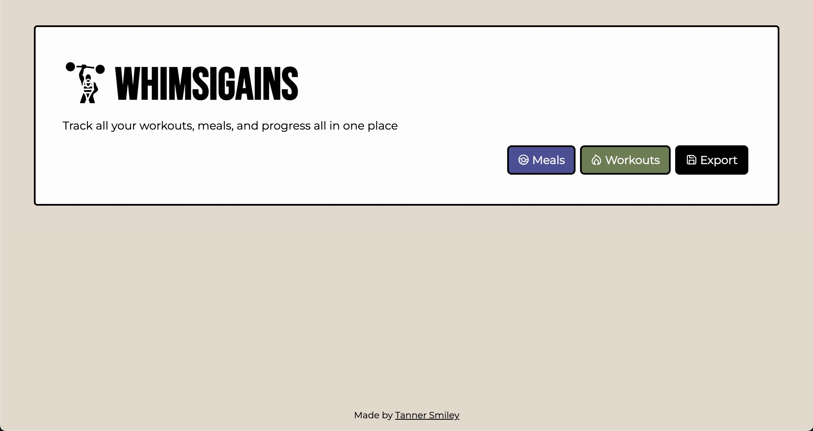
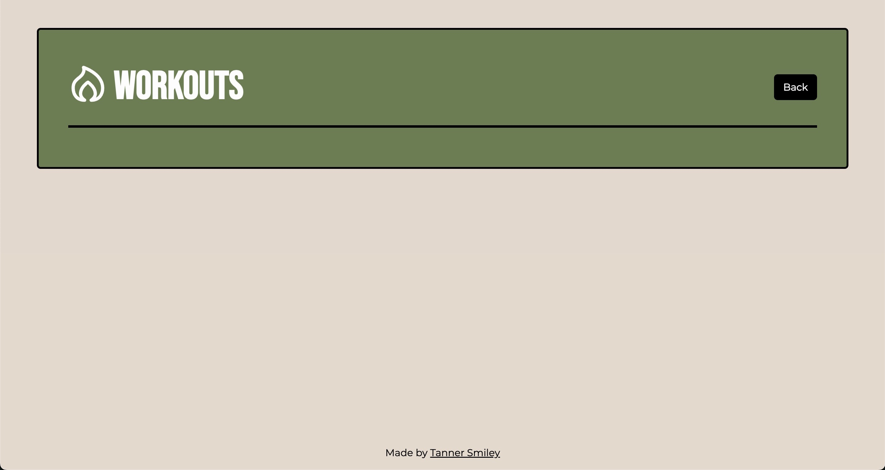

# Whimsigains - Calorie Tracker

Welcome to Whimsigains, your all-in-one calorie tracker built with SvelteKit! Keep track of your workouts, meals, and progress effortlessly using this intuitive and sleek application.

## Features

- Track your workouts, meals, and progress all in one place.
- Visualize your calorie intake and burn with easy-to-understand charts.
- Set personalized goals and monitor your fitness journey.
- Responsive design for seamless use across devices.

## Screenshots

_Dashboard displaying an overview of daily calories consumed and burned._

_Easily log your workouts and keep track of exercise details._

## Installation and Build Instructions

Follow these steps to get Whimsigains up and running locally:

1. Clone the repository: `git clone https://github.com/thehatclub/whimsigains.git`
2. Navigate to the project directory: `cd whimsigains`
3. Install dependencies: `npm install`
4. Build the project: `npm run build`
5. Start the preview: `npm run preview`

## Usage

1. Sign up or log in to your Whimsigains account.
2. Navigate through the intuitive interface to log your workouts and meals.
3. Monitor your daily calorie intake and burn on the dashboard.
4. Set and track your fitness goals to stay motivated.

## Contributing

Contributions are welcome! If you'd like to contribute to Whimsigains, please follow these steps:

1. Fork the repository.
2. Create a new branch for your feature: `git checkout -b feature-name`
3. Make your changes and commit them: `git commit -m "Add new feature"`
4. Push to your forked repository: `git push origin feature-name`
5. Open a pull request, describing your changes in detail.

## Feedback and Support

If you encounter any issues or have suggestions for improvements, feel free to [open an issue](https://github.com/thehatclub/whimsigains/issues). We appreciate your feedback!

---

Thank you for using Whimsigains! We hope this calorie tracker helps you achieve your fitness goals and maintain a healthier lifestyle.
